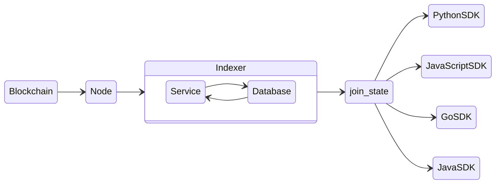

<div align="right">

  [](LICENSE.md)
  

</div>

---

<div>
    
    <h1 align="left">Algorand Node</h1>
    <h3 align="left">Block Foundation Docker Containers</h3>
</div>

---

<p align="center">
    
</p>

The primary purpose of this Indexer is to provide a REST API interface of API calls to support searching the Algorand Blockchain. The Indexer REST APIs retrieve the blockchain data from a PostgreSQL compatible database that must be populated. This database is populated using the same indexer instance or a separate instance of the indexer which must connect to the algod process of a running Algorand node to read block data. This node must also be an Archival node to make searching the entire blockchain possible.



## Quick Start

Run Algorand in a Docker container

### Build

``` sh
docker build -t algorand .
```

### Running

``` sh
docker run -d -p 8080:8080 --name algorand bjweaver/algorand-node
```

> To run on testnet:

``` sh
docker run -d -p 8080:8080 --name algorand bjweaver/algorand-node:testnet
```

### Status

> To obtain node status:

``` sh
docker exec algorand /algorand/node/goal node status -d /algorand/node/data
```

## API Connection

API will listen on `localhost:8080`

``` sh
curl 127.0.0.1:8080/swagger.json
```

## Disclaimer

**THIS SOFTWARE IS PROVIDED AS IS WITHOUT WARRANTY OF ANY KIND, EITHER EXPRESS OR IMPLIED, INCLUDING ANY IMPLIED WARRANTIES OF FITNESS FOR A PARTICULAR PURPOSE, MERCHANTABILITY, OR NON-INFRINGEMENT.**
