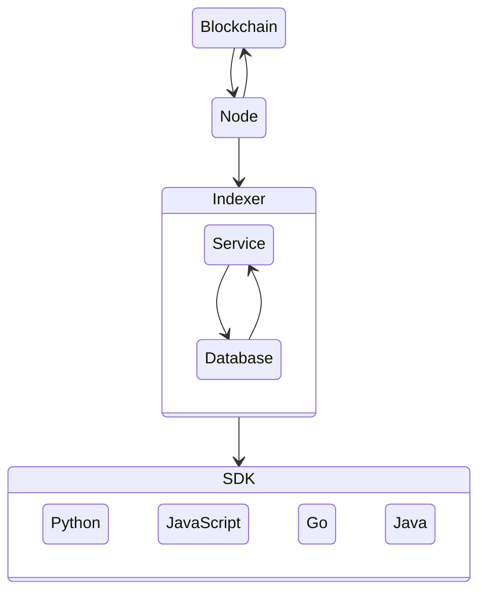

<div align="right">

  [](LICENSE.md)
  

</div>

---

<div>
    
    <h1 align="left">Algorand Node</h1>
    <h3 align="left">Block Foundation Docker Containers</h3>
</div>

---

<p align="center">
    
</p>

## Network



## Quick Start

Run Algorand in a Docker container

### Build

``` sh
docker build -t algorand .
```

### Running

``` sh
docker run -d -p 8080:8080 --name algorand bjweaver/algorand-node
```

> To run on testnet:

``` sh
docker run -d -p 8080:8080 --name algorand bjweaver/algorand-node:testnet
```

### Status

> To obtain node status:

``` sh
docker exec algorand /algorand/node/goal node status -d /algorand/node/data
```

### API Connection

API will listen on `localhost:8080`

``` sh
curl 127.0.0.1:8080/swagger.json
```

## Resources

### Algorand

- [Algorand](https://www.algorand.com/)
- [Algorand | Developer](https://developer.algorand.org/)

#### Algorand SDK

- [Algorand SDK | Docs](https://py-algorand-sdk.readthedocs.io/en/latest/)
- [Algorand SDK | GitHub](https://github.com/algorand/py-algorand-sdk/)

#### Algorand Go

- [Algorand Go | GitHub](https://github.com/algorand/go-algorand)

#### AlgoDjango
- [AlgoDjango | Tutorial](https://developer.algorand.org/solutions/getting-started-with-python-algorand-sdk-and-django/)
- [AlgoDjango | GitHub](https://github.com/ipaleka/algodjango)

#### Algorand PyTeal

- [Algorand PyTeal](https://github.com/algorand/pyteal)
- [Algorand PyTeal | Utils](https://github.com/algorand/pyteal-utils)
- [Algorand PyTeal | Course](https://github.com/algorand-devrel/pyteal-course)

#### Algorand Sandbox

- [Algorand Sandbox](https://github.com/algorand/sandbox)

## Legal

### Disclaimer

**THIS SOFTWARE IS PROVIDED AS IS WITHOUT WARRANTY OF ANY KIND, EITHER EXPRESS OR IMPLIED, INCLUDING ANY IMPLIED WARRANTIES OF FITNESS FOR A PARTICULAR PURPOSE, MERCHANTABILITY, OR NON-INFRINGEMENT.**
